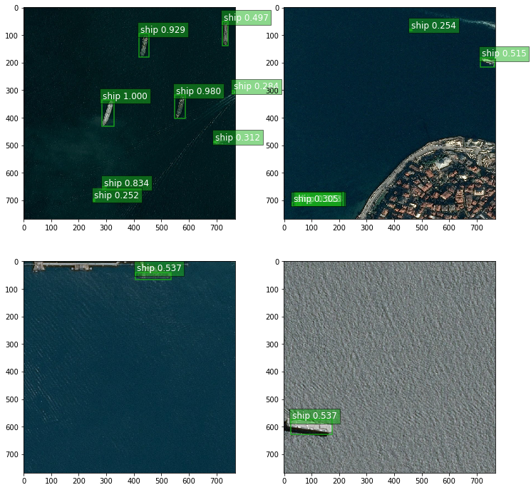
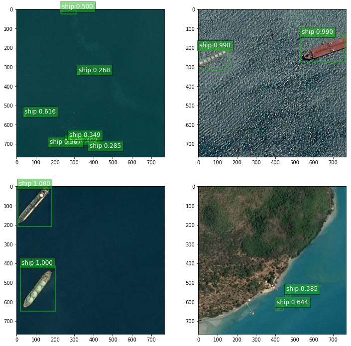

# SageMaker Object Detection Project

## Introduction

Shipping traffic is growing fast. More ships increase the chances of infractions at sea like environmentally devastating ship accidents, piracy, illegal fishing, drug trafficking, and illegal cargo movement. This has compelled many organizations, from environmental protection agencies to insurance companies and national government authorities, to have a closer watch over the open seas. Airbus (http://www.intelligence-airbusds.com/satellite-data/) offers comprehensive maritime monitoring services by building a meaningful solution for wide coverage, fine details, intensive monitoring, premium reactivity and interpretation response. Combining its proprietary-data with highly-trained analysts, they help to support the maritime industry to increase knowledge, anticipate threats, trigger alerts, and improve efficiency at sea.

Airbus has recruited your team to locate ships in satellite images, and put an aligned bounding box segment around the ships you locate. A long term contract will be provided to your team based on a Proof-of-Concept model that you provide to Airbus. Airbus has been doing most of their analytics and machine learning on-prem, in their own data centers, and is interested in learning about the advantages of using AWS Sagemaker for model training and hosting. Currently, Airbus is producing more satellite data than it can process, and is interested in an automated solution. *

## About the Dataset

This dataset is focused on recognition of ships by machine learning. This dataset contains a database of small images of tankers, commercial ships or fishing ships. It also contains some large scale SPOT images at 1.5 m. resolution to test your ship detection algorithm on real satellite images.

The data can be downloaded here:

https://www.kaggle.com/c/airbus-ship-detection/data

(*Hint*: Also check out recent submissions/ discussions)
The size of this dataset is 3.8 GB. It contains 7,074 images (256px by 256px) with a portion of a ship on it. The objects.csv contains a list of images with ships on it indicating the file path, the class (cls), the top left corner (tlx, tly) and the bottom right (xbr, ybr) of the ship. It also contains 20,000 more images containing background (i.e. images with no ships).

Many images do not contain ships, and those that do may contain multiple ships. Ships within and across images may differ in size (sometimes significantly) and be located in open sea, at docks, marinas, etc.

The train_ship_segmentations.csv file provides the ground truth (in run-length encoding format) for the training images. The sample_submission files contains the images in the test images.

Airbus data scientists realized that thinking of the problem as having two distinct steps helped:

1. Remove noise from the original image and only consider a “mask” or minimal representation of the image. This “mask” (center image below) is what they were predicting as an output using ML
2. Draw a bounding box around the predicted mask

## Results

Here is an example prediction after training for 8 hours on an ml.p3.2xlarge instance

